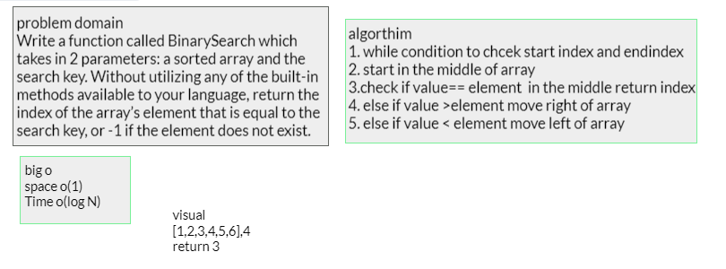

# binarySearch

Approach & Efficiency

1. start in the middle of array
2. check if value== element  in the middle return index
3. else if value >element move right of array
4. else if value < element move left of array

