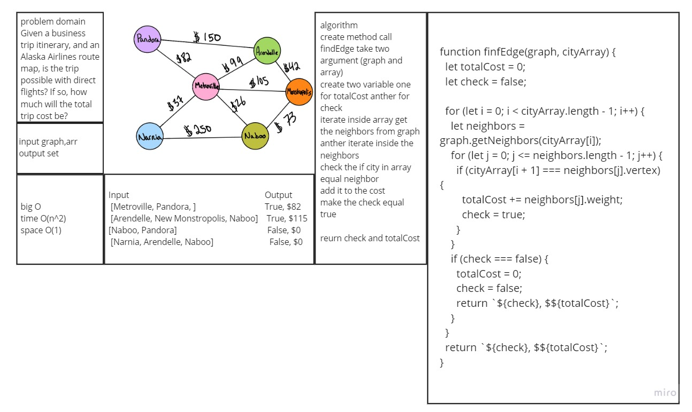

# findEdge

## Challenge

Determine whether the trip is possible with direct flights, and how much it would cost.
Write a function called business trip
Arguments: graph, array of city names
Return: cost or null

## Approach & Efficiency

**Big O:**

- Time

      - **O(n^2)** 

- Space

      - **O(1)** 

