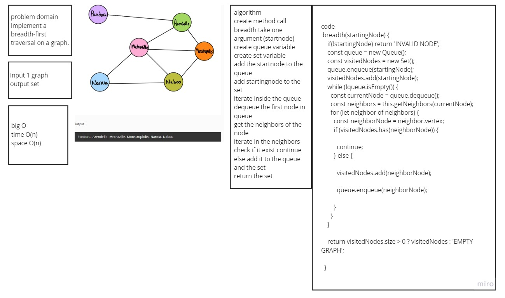

# graph-breadth-first

## Challenge

Implement a breadth-first traversal on a graph.
Write the following method for the Graph class:

Arguments: Node
Return: A collection of nodes in the order they were visited.
Display the collection

## Approach & Efficiency

**Big O:**

- Time

      - **O(n)** 

- Space

      - **O(n)** 

