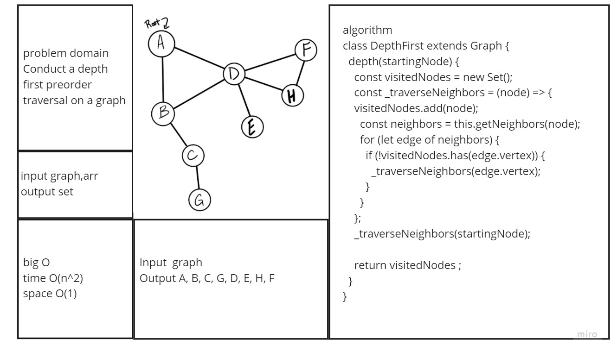

# graph-depth-first

## Challenge

Conduct a depth first preorder traversal on a graph
Write the following method for the Graph class:

depth first
Arguments: An adjacency list as a graph
Return: A collection of nodes in their pre-order depth-first traversal order
Display the collection

## Approach & Efficiency

**Big O:**

- Time

      - **O(n^2)** 

- Space

      - **O(n)** 

