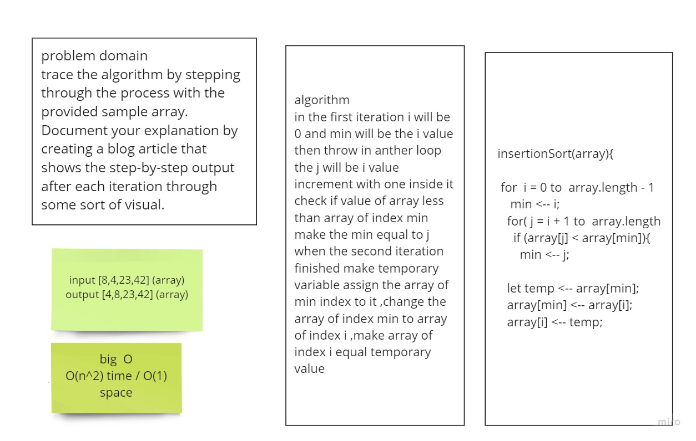

# Challenge

trace the algorithm by stepping through the process with the provided sample array. Document your explanation by creating a blog article that shows the step-by-step output after each iteration through some sort of visual.

# Approach & Efficiency

 implement working code O(n^2) time / O(1) space

