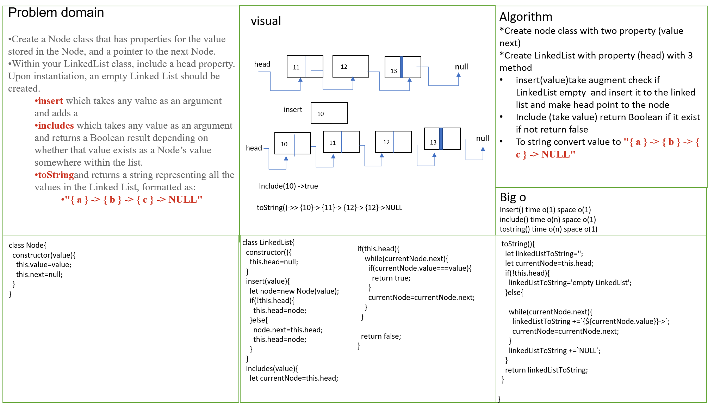
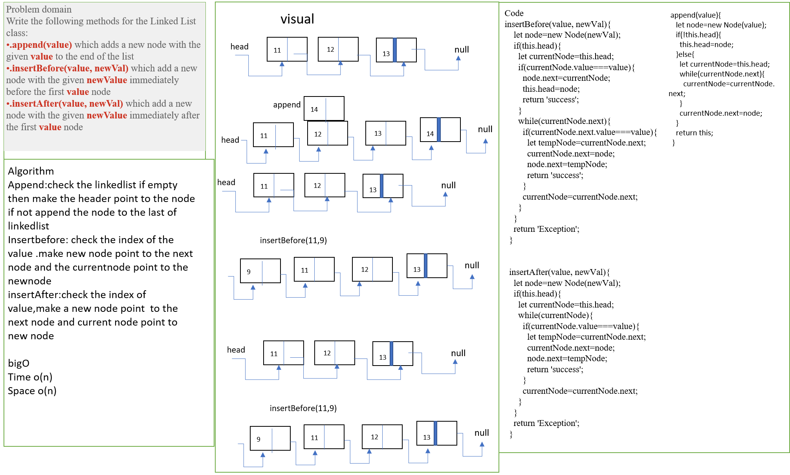
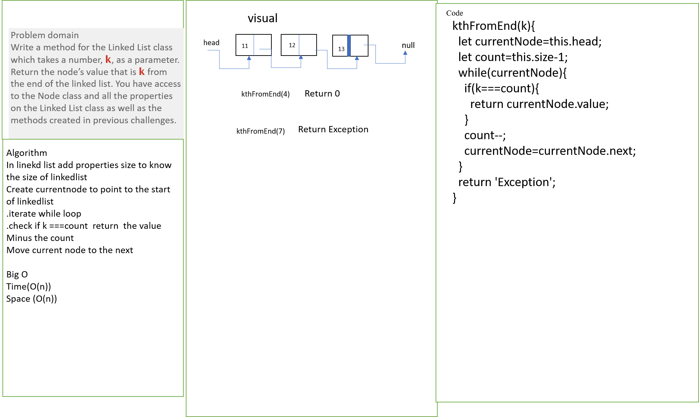

# Singly Linked List

A Linked List is a sequence of Nodes that are connected/linked to each other. The most defining feature of a Linked List is that each Node references the next Node in the link.

## Challenge

1. create node class has properties (value,next)
2. create linkedList class has head property and methods:

* insert method take a value and add node to the head
* include method take a value and check if it in the linked list
* toString format  the value to be {a}->{b}->NULL

## Approach & Efficiency

* create node class has two properties (value & next pointer to point to the next node by default it's null)
* create linkedList class has property (head) and methods
  * insert method that insert node to the beginning of list
  * include method that search for value if exist in linkedlist
  * toString format  the value to be {a}->{b}->NULL

## Code Challenge: Class 06

build a new methods for linked list

append(value) which adds a new node with the given value to the end of the list
insertBefore(value, newVal) which add a new node with the given newValue immediately before the first value node
insertAfter(value, newVal) which add a new node with the given newValue immediately after the first value node

## Approach & Efficiency

* .append method:adds a new node with the given value to the end of the Linked list.
* insertBefore method: add a new node with the given newValue immediately before the value node.
* .insertAfter method: which add a new node with the given newValue immediately after the value node.

## Code Challenge: Class 07

Write a method for the Linked List class kthFromEnd(k) which takes a number, k, as a parameter. Return the node’s value that is k from the end of the linked list. You have access to the Node class and all the properties on the Linked List class as well as the methods created in previous challenges.

## Approach & Efficiency

kthFromEnd(k) which takes a number, k, as a parameter. Return the node value that is k from the end of the linked list.

