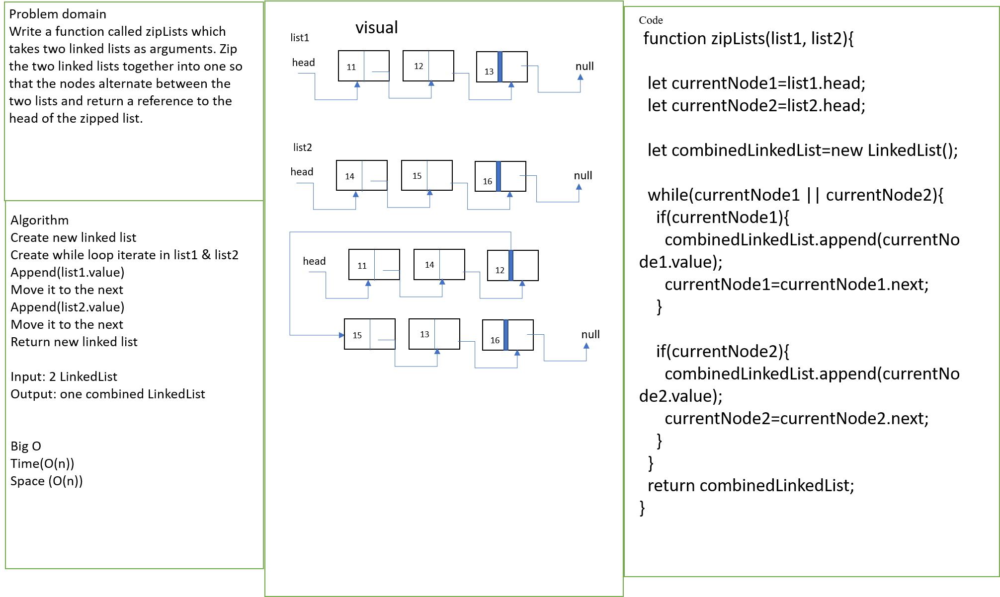

# llZip

## Challenge

Write a function called zipLists which takes two linked lists as arguments. Zip the two linked lists together into one so that the nodes alternate between the two lists and return a reference to the head of the zipped list.

## Approach & Efficiency

append the value of list one to the combinedlinkedlist then append list two value to the combinedlinkedlist

