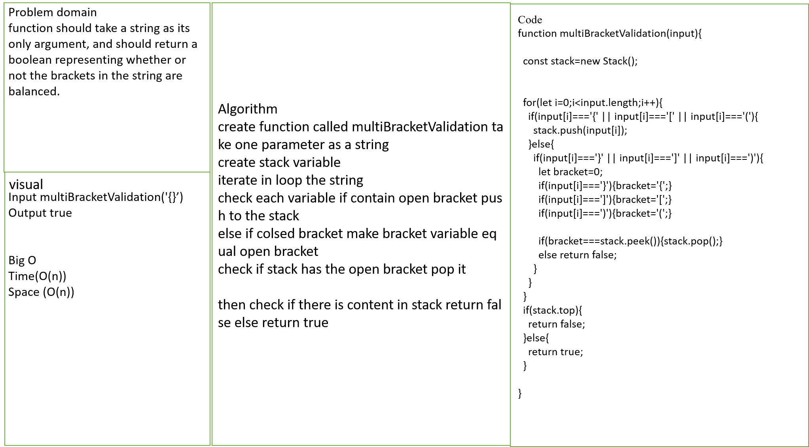

# multiBracketValidation

## Challenge

function should take a string as its only argument, and should return a boolean representing whether or not the brackets in the string are balanced. There are 3 types of brackets:

Round Brackets : ()
Square Brackets : []
Curly Brackets : {}

## Approach & Efficiency

create function called multiBracketValidation take one parameter as a string
create stack variable
iterate in loop the string
check each variable if contain open bracket push to the stack
else if colsed bracket make bracket variable equal open bracket
check if stack has the open bracket pop it

then check if there is content in stack return false else return true

