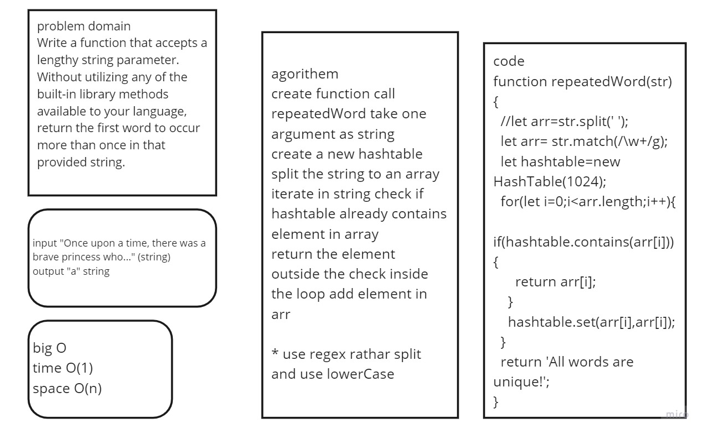

# Repeated Word

Find the first repeated word in a string.

## Challenge

Write a function that accepts a lengthy string parameter.
Without utilizing any of the built-in library methods available to your language, return the first word to occur more than once in that provided string.
Structure and Testing
run npm test repeated-word to check that the function is working correctly

## Approach & Efficiency

create function repeatedWord that accepts a lengthy string as a parameter
split the string to an array of words using regex
create a new hashtable with the array length as its size
iterate over the array, let the current word toLowerCase() equals key
check if the key already exists in the hashtable, if yes, return it, if not, add it.
time: O(1)
space: O(n)

