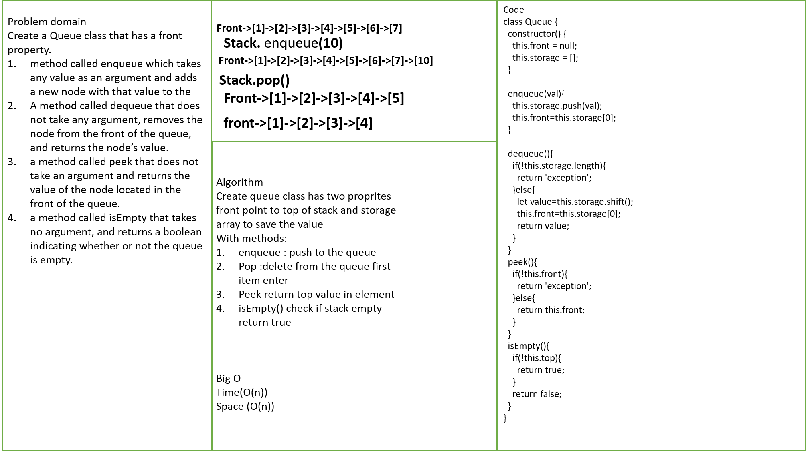
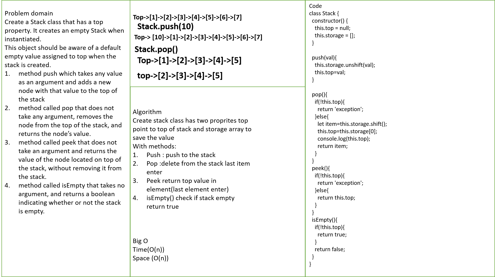

# stacks-and-queues

A stack is a data structure that consists of Nodes. Each Node references the next Node in the stack, but does not reference its previous.

a queue is a collection of entities that are maintained in a sequence and can be modified by the addition of entities at one end of the sequence and the removal of entities from the other end of the sequence.

## Challenge

* Create a Node class that has properties for the value stored in the Node, and a pointer to the next node.

* Create a Stack class that has a top property. It creates an empty Stack when instantiated.

* This object should be aware of a default empty value assigned to top when the stack is created.

* Define a method called push which takes any value as an argument and adds a new node with that value to the top of the stack with an O(1) Time performance.

* Define a method called pop that does not take any argument, removes the node from the top of the stack, and returns the node’s value.
Should raise exception when called on empty stack

* Define a method called peek that does not take an argument and returns the value of the node located on top of the stack, without removing it from the stack.
Should raise exception when called on empty stack

* Define a method called isEmpty that takes no argument, and returns a boolean indicating whether or not the stack is empty.

* Create a Queue class that has a front property. It creates an empty Queue when instantiated.

* This object should be aware of a default empty value assigned to front when the queue is created.

* Define a method called enqueue which takes any value as an argument and adds a new node with that value to the back of the queue with an O(1) Time performance.

* Define a method called dequeue that does not take any argument, removes the node from the front of the queue, and returns the node’s value.
Should raise exception when called on empty queue

* Define a method called peek that does not take an argument and returns the value of the node located in the front of the queue, without removing it from the queue.
Should raise exception when called on empty queue

* Define a method called isEmpty that takes no argument, and returns a boolean indicating whether or not the queue is empty.

## Approach & Efficiency

* Stack

push space o(1) time O(1)
pop space o(1) time O(1)
peek space o(1) time O(1)
isEmpty space o(1) time O(1)

* Queue

enqueue space o(1) time O(1)
dequeue space o(1) time O(1)
peek space o(1) time O(1)
isEmpty space o(1) time O(1)

