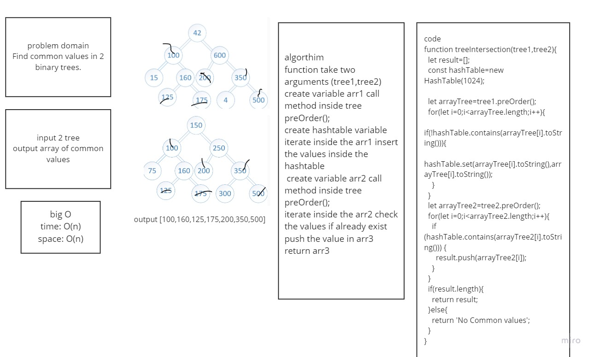

# treeIntersection

Find common values in 2 binary trees.

## Challenge

Write a function called tree_intersection that takes two binary tree parameters.
Without utilizing any of the built-in library methods available to your language, return a set of values found in both trees.

## Approach & Efficiency

create a function that takes two trees as an argument.
create a new hashtable.
convert the input trees to arrays using preOrder traverse tree method.
add the first tree values to the hashtable
iterate over the second tree, check each value, if it is already in the hashtable, push it to the result array
return the array or an exception
time: O(n)
space: O(n)

